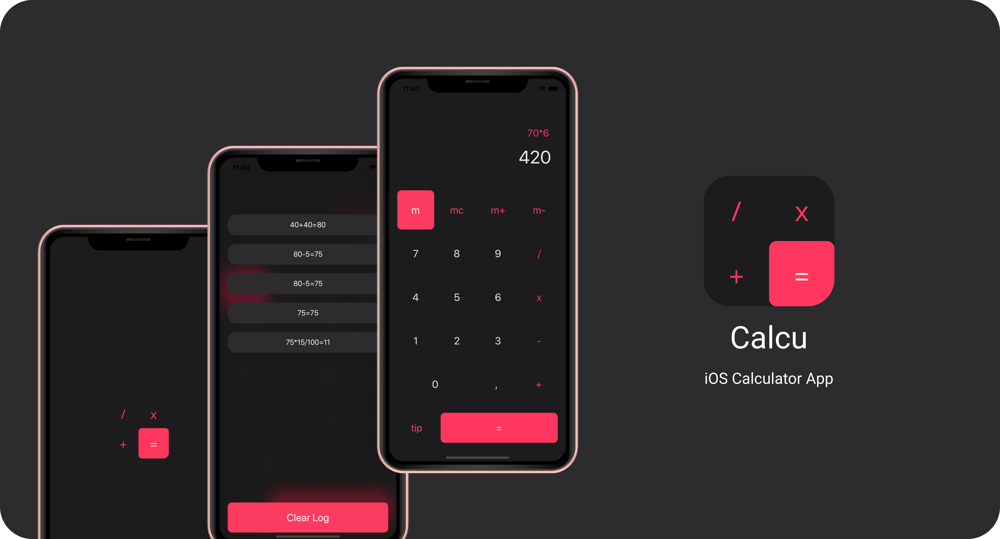
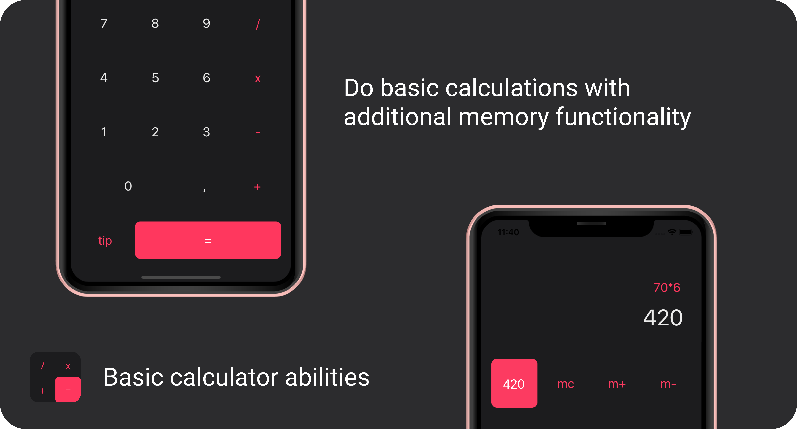
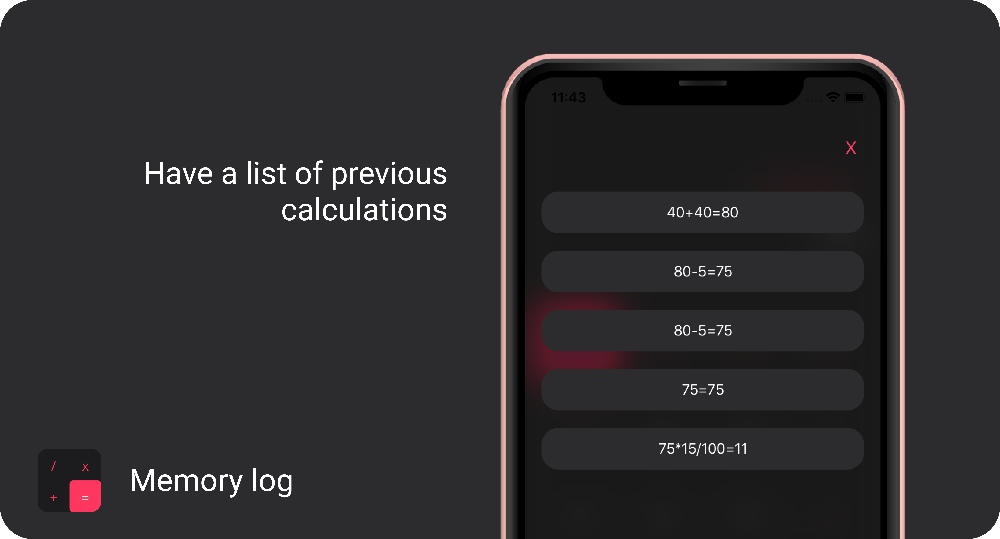
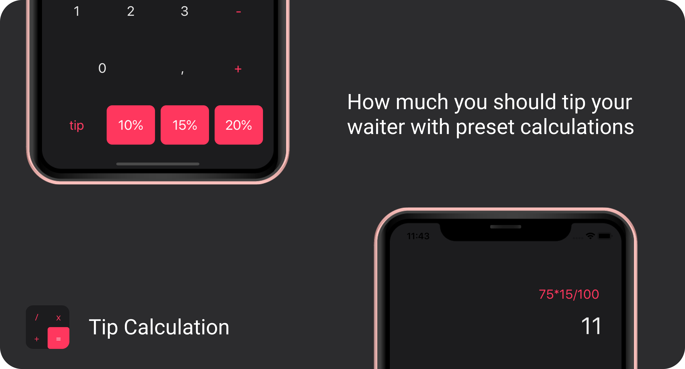

<!--Calcu README.MD-->
<!--
*** I'm using markdown "reference style" links for readability.
*** Reference links are enclosed in brackets [ ] instead of parentheses ( ).
*** See the bottom of this document for the declaration of the reference variables
-->
[![Contributors][contributors-shield]][contributors-url]
[![Forks][forks-shield]][forks-url]
[![Stargazers][stars-shield]][stars-url]
[![LinkedIn][linkedin-shield]][linkedin-url]

<!-- PROJECT LOGO -->
<br />
<p align="center">
  <a href="https://github.com/ArmandPretorius/calcu">
    
  </a>

  <h3 align="center">Calcu</h3>

  <p align="center">
    The simple calculator app.
    <br />
    <a href="https://github.com/ArmandPretorius/calcu"><strong>Explore the docs »</strong></a>
    <br />
    <br />
    <a href="https://github.com/ArmandPretorius/calcu">View Demo</a>
    ·
    <a href="https://github.com/ArmandPretorius/calcu/issues">Report Bug</a>
    ·
    <a href="https://github.com/ArmandPretorius/calcu/issues">Request Feature</a>
  </p>
</p>


<!-- TABLE OF CONTENTS -->
## Table of Contents

* [About the Project](#about-the-project)
  * [Built With](#built-with)
  * [Installation](#installation)
* [Features](#features)
  * [Basic Calculator Abilities](#basic)
  * [Memory Log](#memory)
  * [Tip Calculation](#tip)
* [Usage](#usage)
* [Logic](#logic)
* [Contribution](#contribution)
* [License](#license)
* [Challenges](#challenges)
* [Contact](#contact)

<!-- ABOUT THE PROJECT -->
## About The Project
  

Calcu is a simple calculator app with basic memory capabilities. You can also use Calcu to calculate appropriate tips for waiters.

This Project is for my Term 4 elective, Native iOS Development 304, for which we were tasked to create a basic calculator application with memory functionality.

### Built With
This iOS application was build using:
* [Xcode](https://developer.apple.com/xcode/) as IDE
* [Swift](https://developer.apple.com/swift/) as Language


### Installation

1. Download and Install Xcode [https://developer.apple.com/xcode/](https://developer.apple.com/xcode/) from the App Store (Only available on MacOS)
2. Clone the repo
```sh
git clone https:://github.com/ArmandPretorius/calcu.git
```
3. Then open the project in Xcode


<!-- FEATURES -->
## Features

### Basic Calculator Abilities
 

### Memory log


### Tip Calculation
  

<!-- USAGE -->
## Usage

When opening Calcu, you can calculate basic calculations like adding, subtracting, multiplying and dividing.

Next to the equal sign is a tip button, which gives you three options when clicked on. You can then add 10%, 15% or 20% to your total bill to tip your waiter appropriately.

You can save the answer to your memory, recall the memory, add and subtract from the memory and also clear the memory.

When clicking on the answers, you get presented with the history/log of all your previous calculations. At the bottom you can clear the log.

[View Demo](https://www.youtube.com/watch?v=zh_kbkIF5H0)

<!-- HOW DOES IT WORK -->
## Logic

The application uses [NSExpressions](https://docs.swift.org/swift-book/LanguageGuide/BasicOperators.html) to make the calculations
The application uses [UserDefaults](https://medium.com/better-programming/userdefaults-in-swift-4-d1a278a0ec79) to save the calculation log and memory.


<!-- Changes Made -->
## Challenges

* I would like to make it possible to select a log and use it for the next calculation.
* I'd also like to add an AC ability.
* I'd also like to add more gesture based interactions.

<!-- CONTRIBUTING -->
## Contributing

Contributions are what make the open source community such an amazing place to be learn, inspire, and create. Any contributions you make are **greatly appreciated**.

1. Fork the Project
2. Create your Feature Branch (`git checkout -b feature/YourAmazingFeature`)
3. Commit your Changes (`git commit -m 'Add some AmazingFeature'`)
4. Push to the Branch (`git push origin feature/YourAmazingFeature`)
5. Open a Pull Request


<!-- LICENSE -->
## License

Distributed under the MIT License. See `LICENSE` for more information.


<!-- CONTACT -->
## Contact

Armand Pretorius - [@amplified_designs](https://www.instagram.com/amplified_designs/) - 170045@virtualwindow.co.za

Project Link: [https://github.com/ArmandPretorius/calcu](https://github.com/ArmandPretorius/calcu)


<!-- MARKDOWN LINKS & IMAGES -->
[contributors-shield]: https://img.shields.io/github/contributors/ArmandPretorius/calcu.svg?style=flat-square
[contributors-url]: https://github.com/ArmandPretorius/calcu/graphs/contributors
[forks-shield]: https://img.shields.io/github/forks/ArmandPretorius/calcu.svg?style=flat-square
[forks-url]: https://github.com/ArmandPretorius/calcu/network/members
[stars-shield]: https://img.shields.io/github/stars/ArmandPretorius/calcu.svg?style=flat-square
[stars-url]: https://github.com/ArmandPretorius/calcu/stargazers
[issues-shield]: https://img.shields.io/github/issues/ArmandPretorius/calcu.svg?style=flat-square
[issues-url]: https://github.com/ArmandPretorius/calcu/issues
[license-shield]: https://img.shields.io/github/license/ArmandPretorius/calcu.svg?style=flat-square
[license-url]: https://github.com/ArmandPretorius/calcu/master/LICENSE.txt
[linkedin-shield]: https://img.shields.io/badge/-LinkedIn-black.svg?style=flat-square&logo=linkedin&colorB=555
[linkedin-url]: https://www.linkedin.com/in/armand-pretorius-293b3a18a
