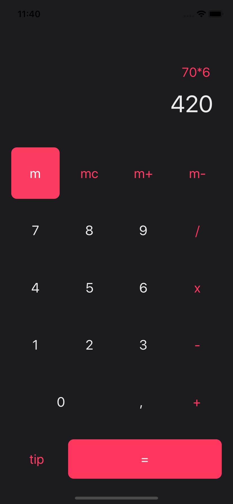
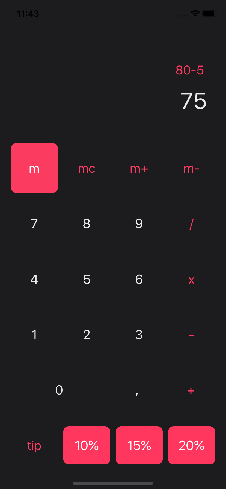
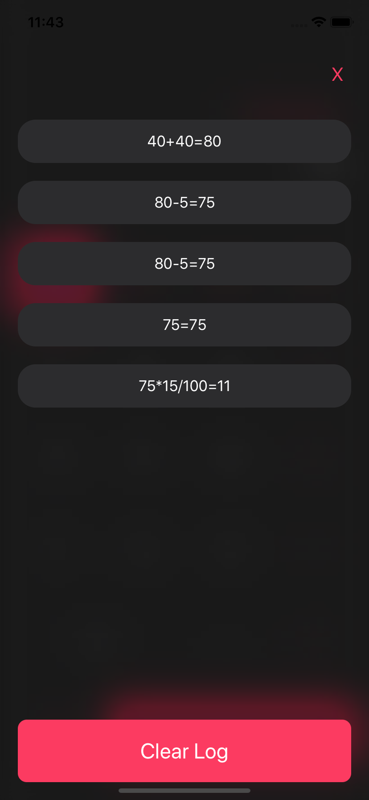

<!--Calcu README.MD-->

<!-- PROJECT LOGO -->
<br />
<p align="center">
  <a href="https://github.com/ArmandPretorius/calcu">
    
  </a>

  <h3 align="center">Calcu</h3>

  <p align="center">
    The simple calculator app.
    <br />
    <a href="https://github.com/ArmandPretorius/calcu"><strong>Explore the docs »</strong></a>
    <br />
    <br />
    <a href="https://github.com/ArmandPretorius/calcu">View Demo</a>
    ·
    <a href="https://github.com/ArmandPretorius/calcu/issues">Report Bug</a>
    ·
    <a href="https://github.com/ArmandPretorius/calcu/issues">Request Feature</a>
  </p>
</p>


<!-- TABLE OF CONTENTS -->
## Table of Contents

* [About the Project](#about-the-project)
  * [Built With](#built-with)
  * [Installation](#installation)
* [Usage](#usage)
  * [Logic](#logic)
* [Changes](#changes)
* [Contact](#contact)

<!-- ABOUT THE PROJECT -->
## About The Project
| --- | --- | --- |
|  |  |  |

Calcu is a simple calculator app with basic memory capabilities. You can also use Calcu to calculate appropriate tips for waiters.

This Project is for my Term 4 elective, Native iOS Development 304, for which we were tasked to create a basic calculator application with memory functionality.

### Built With
This iOS application was build using:
* [Xcode](https://developer.apple.com/xcode/) as IDE
* [Swift](https://developer.apple.com/swift/) as Language


### Installation

1. Download and Install Xcode [https://developer.apple.com/xcode/](https://developer.apple.com/xcode/) from the App Store (Only available on MacOS)
2. Clone the repo
```sh
git clone https:://github.com/ArmandPretorius/calcu.git
```
3. Then open the project in Xcode

<!-- USAGE -->
## Usage

When opening Calcu, you can calculate basic calculations like adding, subtracting, multiplying and dividing.

Next to the equal sign is a tip button, which gives you three options when clicked on. You can then add 10%, 15% or 20% to your total bill to tip your waiter appropriately.

You can save the answer to your memory, recall the memory, add and subtract from the memory and also clear the memory.

When clicking on the answers, you get presented with the history/log of all your previous calculations. At the bottom you can clear the log.

[View Demo](https://www.youtube.com/watch?v=zh_kbkIF5H0)
<!-- HOW DOES IT WORK -->
## Logic

The application uses [NSExpressions](https://docs.swift.org/swift-book/LanguageGuide/BasicOperators.html) to make the calculations
The application uses [UserDefaults](https://medium.com/better-programming/userdefaults-in-swift-4-d1a278a0ec79) to save the calculation log and memory.


<!-- Changes Made -->
## Changes

* I would like to make it possible to select a log and use it for the next calculation.
* I'd also like to add an AC ability.
* I'd also like to add more gesture based interactions.

<!-- CONTACT -->
## Contact

Armand Pretorius - 170045@virtualwindow.co.za

Project Link: [https://github.com/ArmandPretorius/calcu](https://github.com/ArmandPretorius/calcu)


<!-- MARKDOWN LINKS & IMAGES -->
[product-screenshot]: home_screenshot.png
